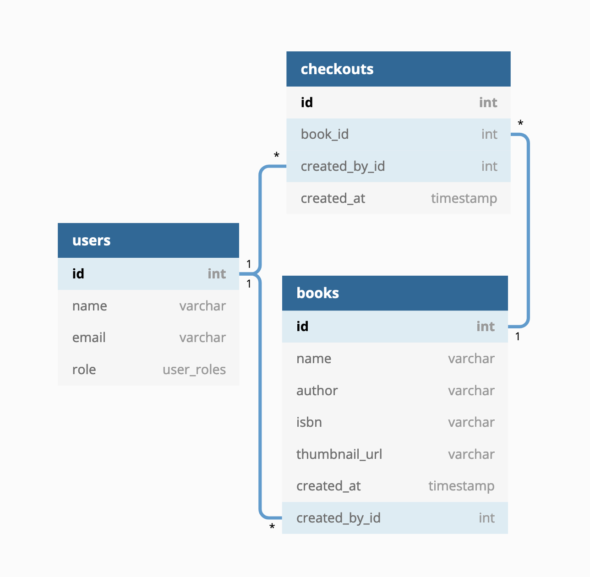

# sturgis-api

[](http://commitizen.github.io/cz-cli/) [](https://conventionalcommits.org)

> A simple library API built with node.js

## Why the name?

[Wikipedia calls this the oldest public library building in the US.](https://en.wikipedia.org/wiki/Sturgis_Library), so I felt like it was a cool name for this project.

## Technical stack

This project is primarily built on Node.js and PostgresSQL. Here is a breakdown of some the libraries that were used:

-   `express` - The API framework that handles routing and requests.
-   `node-isbn` - A tiny library that fetches book information if an ISBN was passed into it. I chose this lib because it exposes a common data shape across multiple supported APIs (OpenLibrary and Google Books).
-   `postgres` - A minimal PostgreSQL client. I chose this because I love the tagged template style of writing queries. Also, `knex.js` & `Objection.js` seemed overkill for a small project like this.
-   `ley` - A DB migration library that runs the db schema files present in `migrations/`. I chose this tiny lib because I felt like `knex.js` was overkill something this simple.
-   `ava` - A testing framework that's super fast. I prefer this over mocha/chai because of the simple API surface. I'm also partial to this because of the power of testing context (`t.context`), which makes it super easy to write tests!

## Developer experience

-   ESLint & prettier are used to autoformat and lint the code. There is a precommit hook setup that will prevent code that contains linting errors from being committed. This removes a lot of minor distractions when working on the important stuff.
-   This repo follows `conventional-commits` guidelines and uses `commitizen` and `commitlint` to enforce them. I like this system because it keeps me organized with my work, thereby making me productive.

## Database design

<div align="center">
  <a href="https://dbdiagram.io/d/5ea4b94539d18f5553fe35ed">
    
  </a>
</div>

The database design was kept simple:

-   `books` - A table to hold (multiple copies of) books.
-   `users` - A table to hold hardcoded users.
-   `checkouts` - A table that holds the books that were checked out from the library.

The relations between the tables are linked up the diagram above.

## Code Organization

I've organized the code in small modules. Each module contains files related to the resource that it is named after. Files such as a router, a database model, utilities and tests. This style of organization keeps me clutterfree and in my opinion, makes it easy to read and understand the code. This also scales well for medium to large apps!

Without further ado, here's the list of modules:

-   `book` - Book related files. These include operations such as adding a book, removing a book, etc.
-   `user` - User related files. Doesn't have a route, but has other user related info.
-   `checkout` - Checkout related files. Operations like checking out a book, retrieving checkout information live here. This module has a lot of validation logic in `checkout-middleware`!
-   `reports` - Contains only one report at this time. The overdue report.
-   `common` - Files that don't belong to any of the modules live in this module. These are methods that are used all over the project, so it doesn't make sense to store them in one of the modules.

Drilling down deeper, let's consider `src/book`:

-   `book-model.js` - DB methods to access the `books` table. This is the single way to access the books table!
-   `book-router.js` - The router that gets hosted on `/api/book`.
-   `book-actions.js` - The "controller" methods for the Book API. This is typically the spot that sends JSON response once the request is complete.
-   `book-middleware.js` - Book related middleware that get used in the `book-router`.
-   `book-utils.js` - A "junk pile" for book related methods that don't fit in any other file. This is where we could interact with services, etc.
-   `test/` - Book related tests. Each endpoint in the `book-router` gets its own test file.

Finally, `src/server.js` runs the express server and `src/router` joins up all the module routers (`book-router`, `checkout-router`, etc.) into one API router, which gets set up in `src/app.js`. The `app` file also sets up other global middleware.

## Testing

The project has a lot of tests. I may have gone a wee bit overboard but it honestly didn't take too much time, once the test environment was setup. It expects a test database to be setup and once that is done, run `npm test` to see the tests in action.

All common setup and teardown files live in `src/common/test-utils`. Some important files:

-   `db-test-utils.js` - Setup and teardown for the database.

    -   When a test suite starts up, it runs all the migrations in `migrations/`.
    -   Before each test, the DB is seeded.
    -   After each test, the DB is truncated.
    -   When all the tests are done, the migrations are rolled back.

-   `api-test-utils.js` - Sets up the API client and API URL.

Module related test utils are stored in the modules (`book/test/book-test-utils`, `checkout/test/checkout-test-utils`).

I didn't spend too much time "organizing" the test files, because I believe that writing tests are all that matters. If there are good tests, we could refactor gradually as we write more.

## Cutting corners

I had to cut some corners to get this done quickly. I've tried to list down the big ones here:

-   The `books` table could end up with a lot of duplicate data. Each time an isbn is added to the `books` table, it really does not care about whether the isbn already exists or not. For example, we could have multiple copies of the "Tale of two cities", which is a waste of space. Ideally, we should track of the copies in a separate table (`book_copies`), thereby removing duplication from the `books` table. While this sounds great, it seemed overkill for a small project. So, I'm documenting it, in case the reader wonders. Here's a simple description of this implementation:

    -   `book_copies` will have the following table schema:

        ```
          create table if not exists book_copies (
              id serial primary key,
              book_id int not null,
              created_at timestamp without time zone default (now() at time zone 'utc')
          );
          alter table books add foreign key (book_id) references books (id);
        ```

    -   Every time a book is added, we'll check if the book already exists. If it doesn't, we add an entry to `books` and to `book_copies`. If it does, we only add an entry to `book_copies`.
    -   When a book is deleted, we'll delete from `book_copies`. If only one copy exists in `book_copies`, we delete the row from `books_copies` and then, we remove the book from `books`.
    -   Basically, `book_copies` becomes the interface the members work with. `books` is a silent table that will be kept in sync, based on alterations to `book_copies`.

-   It's generally best practice to pass in `tz` param for report endpoints. This ensures correct date parsing based on client TZ, which is a great UX improvement and reduces TZ related bugs. I did not implement this for the `reports/overdue` endpoint. It just sets up all of the dates in UTC for now. If this were a production app, this would be treated a bug.

## Project Setup for local development

All the steps listed below are mandatory. DO NOT SKIP ANY OF THEM! 🙅‍♀️

-   Clone the project to your local machine.
-   Ensure you have [nvm](https://github.com/nvm-sh/nvm) installed.
-   From the root of the project, run `nvm use` and follow any subsequent instructions that come up.
-   Then, run `npm install`. Go get some coffee, smell some flowers, and return to your desk. The command must have installed dependencies for all the packages in this project.
-   Setup your PostgreSQL database. I used the [official postgres docker image](https://hub.docker.com/_/postgres).
-   Create an `.env` file in `packages/sturgis-api`. Copy the contents below into that and override the postgres environment variables.

```
NODE_ENV=development
SERVER_HOST=localhost
SERVER_PORT=12345

# OVERRIDE ONLY THESE VARIABLES
PGHOST=localhost
PGPORT=5432
PGDATABASE=sturgisdev
PGUSER=******
PGPASSWORD=******
```

-   Run the migrations. This will setup the DB schema.

```
npm run migrate-db
```

-   Next, seed the database with this command.

```
npm run seed-db
```

-   Finally, run `npm start` and head on over to http://localhost:3000. The app should present itself!

### Running tests

-   Create a database called `sturgistest` in the same postgres instance that was used in the `.env` file.
-   Once done, run `npm test` from the root of the project!
